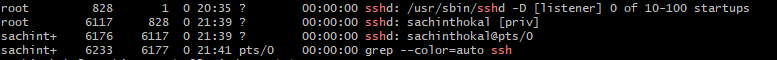
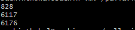
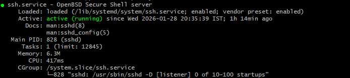
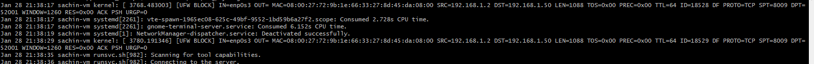

# Day 04 – Linux Practice: Processes and Services
## 1. Process checks
```bash
- ps -ef | grep ssh : ps = Process Status , -e = every process , -f = full format
```


```bash
- pgrep ssh : pgrep = Instead of searching text output (like ps | grep), it directly searches process names , ssh = Any process containing ssh in its name will be returned.
```
   

## 2. Service checks
```bash
- systemctl status ssh
```
   
```bash
- systemctl list-units --type=service --state=running | grep ssh
```
   
## 3. Log checks
```bash
- journalctl -u sshd | tail
```

```bash
- tail -n 20 /var/log/syslog
```

## 4. Mini troubleshooting steps
```bash
1. Check if process exists
   → pgrep ssh
```

```bash
2. Check service status
   → systemctl status ssh
```

```bash
3. Inspect service logs
   → journalctl -u ssh | tail
```

```bash
4. Restart service if needed
   → sudo systemctl restart ssh
```
```bash
5. Verify service is running
   → systemctl status ssh
```


