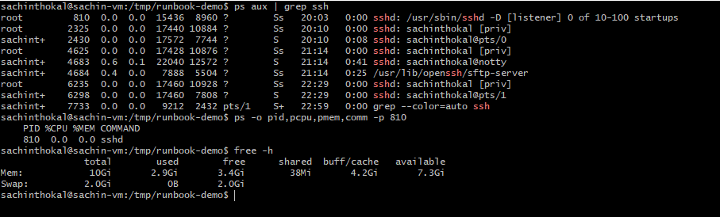
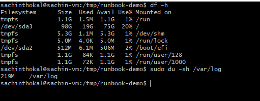
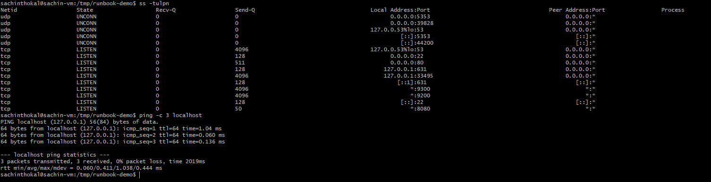
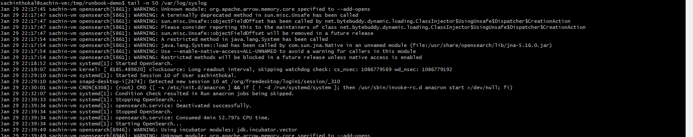

# Day 05 – Linux Troubleshooting Drill: CPU, Memory, and Logs
## Target service / process

**Environment basics:**
```bash
1. uname -a
output :
Linux sachin-vm 6.8.0-90-generic #91~22.04.1-Ubuntu SMP PREEMPT_DYNAMIC Thu Nov 20 15:20:45 UTC 2 x86_64 x86_64 x86_64 GNU/Linux
2. cat /etc/os-release
output:
PRETTY_NAME="Ubuntu 22.04.5 LTS"
NAME="Ubuntu"
VERSION_ID="22.04"
VERSION="22.04.5 LTS (Jammy Jellyfish)"
```
**Filesystem sanity :**
```bash
1. mkdir /tmp/runbook-demo
2. cp /etc/hosts /tmp/runbook-demo/hosts-copy && ls -l /tmp/runbook-demo
```

## Snapshot: CPU & Memory
```bash
pgrep ssh
ps -o pid,pcpu,pmem,comm -p 810
free -h
```

## Snapshot: Disk & IO
```bash
df -h
du -sh /var/log
```

## Snapshot: Network
```bash
ss -tulpn
ping -c 3 localhost
```

## Logs reviewed
```bash
journalctl -u ssh -n 50 --no-pager
tail -n 50 /var/log/syslog
```


## Quick findings
```bash
- Service healthy
- No resource bottleneck
- No log errors
```
## If this worsens (next steps)
```bash
1. Restart service
   systemctl restart ssh

2. Increase log verbosity
   Edit sshd_config → LogLevel DEBUG

3. Deep debugging
   strace -p <PID>
```