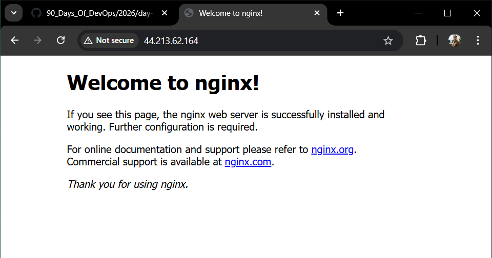
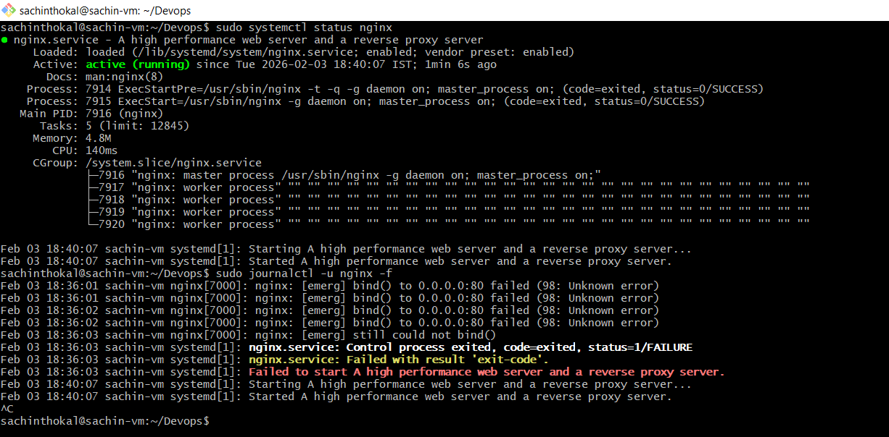
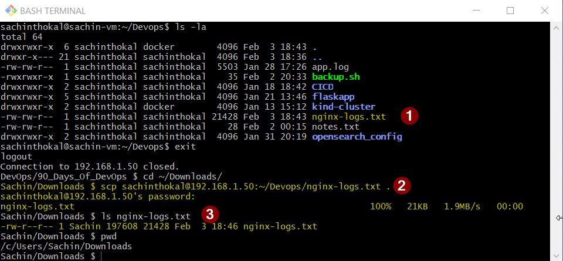

## Documentation : day-08-cloud-deployment

Commands Used
```bash
# 1. Started AWS EC2 and connected via local terminal.
- ssh ubantu@44.213.62.164

# 2. port 80 open in SG for external access.
- EC2 -> Security -> Security Group -> Inbound Rule Edit -> Added Rule HTTP (80) -> Anyware.

# 3. Trired access nginx from external broswer with public ip of the ec2.

- http://44.213.62.164/

```


Extract and save logs to a file
```bash
- sudo systemctl status nginx       # To check status of the service

- sudo journalctl -u nginx -f       # To check full logs of the service

- sudo journalctl -u nginx > nginx-logs.txt     # redirected output to the nginx-logs.txt file.

- scp sachinthokal@192.168.1.50:~/Devops/nginx-logs.txt .       # Copy file to local
- Sachin/Downloads $ ls nginx-logs.txt # Verify log file
```



---

Challenges Faced
```bash
At the time of allowing 80 port for incomming tarrfic by inbounded rule from security group on aws portal.

# Fix - Restarted EC2 Instance and issue got fixed.
```
---

What I Learned
```bash
- how to create ec2 instance.
- how to connect cloud vm from terminal. # {launching and configuring servers}
- how to add ssh key on server. # [ SSH, security, access control]
- how to check and collect logs for services. # [ accessing and analyzing logs]
- how to enable inbound traffic for user access. # [ configuring firewalls and security groups]

```