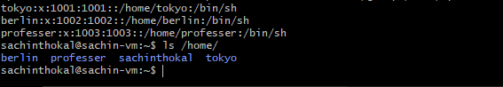
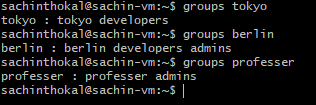
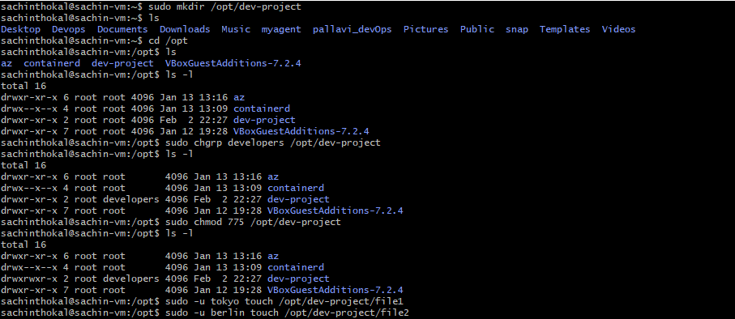
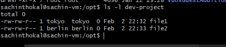
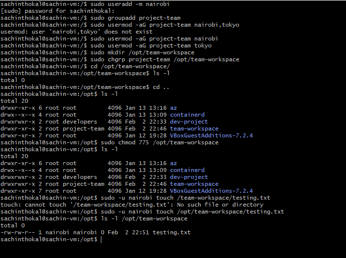

# Day 09 Challenge

## Users & Groups Created
### - Task 1: Create Users
```
sudo useradd -m tokyo
sudo passwd tokyo

sudo useradd -m berlin
sudo passwd berlin

sudo useradd -m professor
sudo passwd professor

# Verify
cat /etc/passwd
ls /home/
```

### - Task 2: Create Groups
```
sudo groupadd developers
sudo groupadd admins

# Verify
cat /etc/group
```

## Group Assignments
```
sudo usermod -aG developers tokyo
sudo usermod -aG developers,admins berlin
sudo usermod -aG admins professor

# Verify
groups tokyo
groups berlin
groups professor
```

## Directories Created
- Create directory : `sudo mkdir /opt/dev-project`
- Change group owner : `sudo chgrp developers /opt/dev-project`
- Set permissions : `sudo chmod 775 /opt/dev-project`
- Test : `sudo -u tokyo touch /opt/dev-project/file1  sudo -u berlin touch /opt/dev-project/file2`
- Verify : `ls -l /opt/dev-project`



## Team Workspace
1. Create user `nairobi` with home directory
2. Create group `project-team`
3. Add `nairobi` and `tokyo` to `project-team`
4. Create `/opt/team-workspace` directory
5. Set group to `project-team`, permissions to `775`
6. Test by creating file as `nairobi`
```bash
sudo useradd -m nairobi
sudo groupadd project-team
sudo usermod -aG project-team nairobi
sudo usermod -aG project-team tokyo
sudo mkdir /opt/team-workspace
sudo chgrp project-team /opt/team-workspace
sudo chmod 775 /opt/team-workspace
sudo -u nairobi touch /opt/team-workspace/testfile
sudo userdel -r nairobi
```

## Commands Used
- **Create users** : useradd -m, passwd
- **Verify users** : cat /etc/passwd, ls /home
- **Create groups** : groupadd
- **Add users to groups** : usermod -aG
- **Check groups** : groups
- **Create directories** : mkdir
- **Change group owner** : chgrp
- **Set permissions** : chmod 775
- **Test as user** : sudo -u username command
- **Verify permissions** : ls -l
- **Delete User (Remove Home Directory Also)** : sudo userdel -r username

## What I Learned
- How to create and manage Linux users
- How groups help manage permissions for teams
- One user can be in multiple groups
- How to set directory ownership and permissions
- 775 allows owner & group full access
- Shared folders are useful for team collaboration
