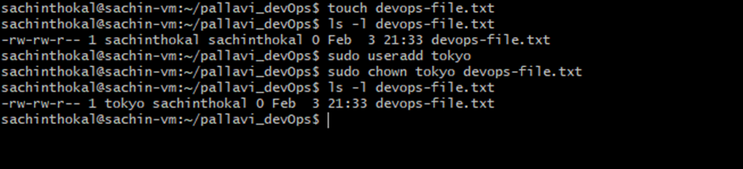
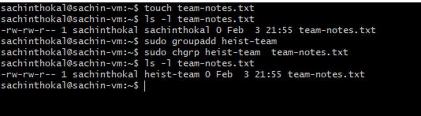
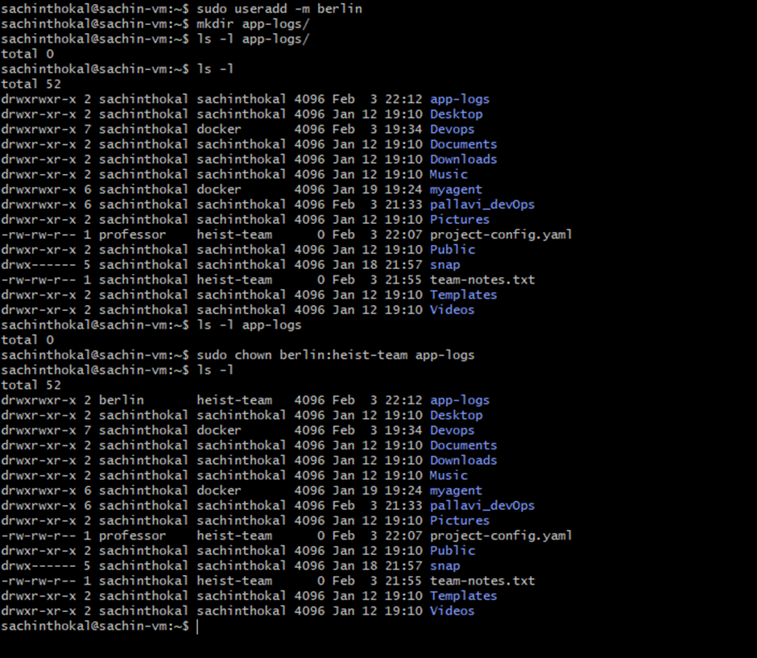
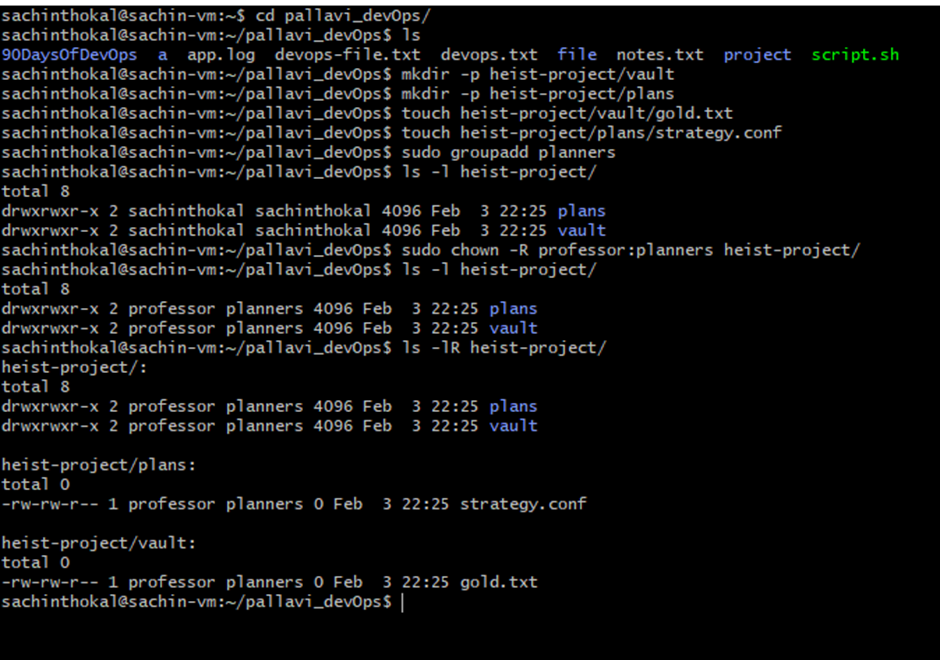
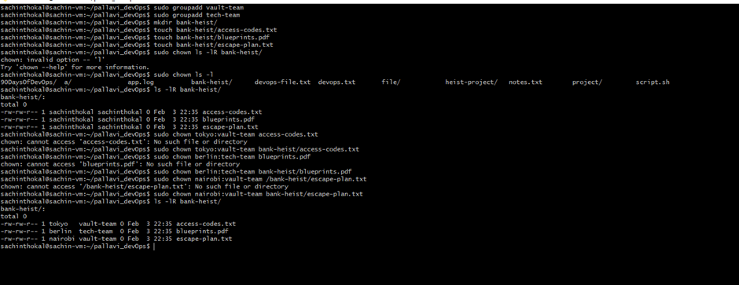

# Day 11 Challenge
## Files & Directories Created
- devops-file.txt
- team-notes.txt
- heist-project/
## Ownership Changes
- devops-file.txt → user:user → berlin:user

## Commands Used
- `chown`, `chgrp`, `ls`, `mkdir`, `touch`

## What I Learned
1. chown changes file owner
2. chgrp changes group
3. -R applies changes to entire directory

## Practice Command
### Task 2: Basic chown Operations
```bash
touch devops-file.txt
ls -l devops-file.txt
sudo chown tokyo devops-file.txt
sudo chown berlin devops-file.txt
ls -l devops-file.txt
```

---
### Task 3: Basic chgrp Operations
```bash
touch team-notes.txt
sudo groupadd heist-team
sudo chgrp heist-team team-notes.txt
ls -l team-notes.txt
```

---
### Task 4: Combined Owner & Group Change
```bash
touch project-config.yaml
sudo chown professor:heist-team project-config.yaml
mkdir app-logs
sudo chown berlin:heist-team app-logs
```

---
### Task 5: Recursive Ownership
```bash
mkdir -p heist-project/vault
mkdir -p heist-project/plans
touch heist-project/vault/gold.txt
touch heist-project/plans/strategy.conf
sudo groupadd planners
sudo chown -R professor:planners heist-project/
ls -lR heist-project/
```

---
### Task 6: Practice Challenge
```bash
sudo useradd tokyo
sudo useradd berlin
sudo useradd nairobi
sudo groupadd vault-team
sudo groupadd tech-team
mkdir bank-heist
touch bank-heist/access-codes.txt
touch bank-heist/blueprints.pdf
touch bank-heist/escape-plan.txt
sudo chown tokyo:vault-team bank-heist/access-codes.txt
sudo chown berlin:tech-team bank-heist/blueprints.pdf
sudo chown nairobi:vault-team bank-heist/escape-plan.txt
```

