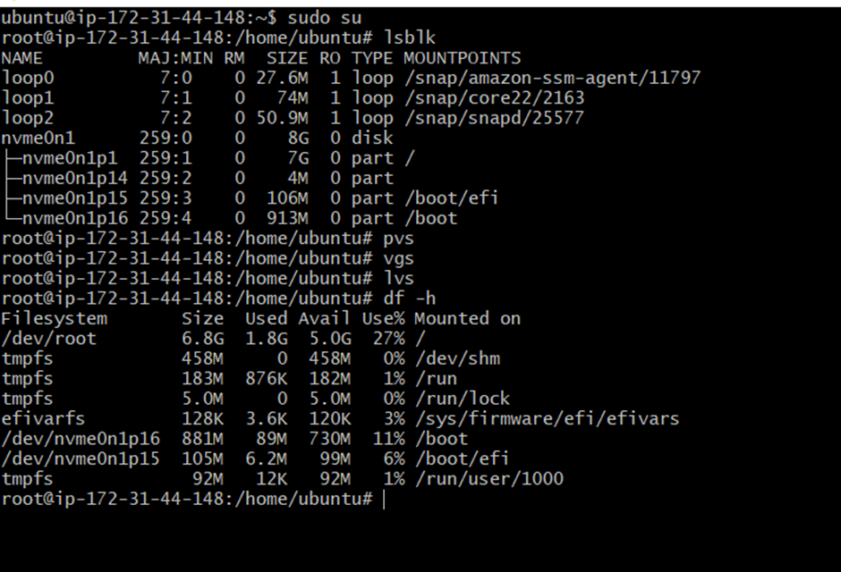
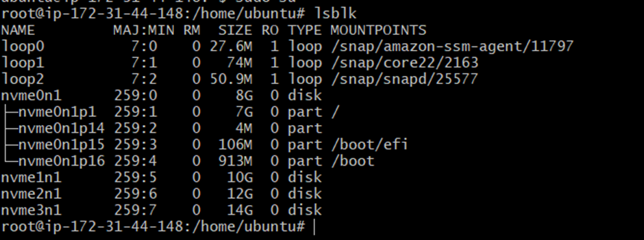
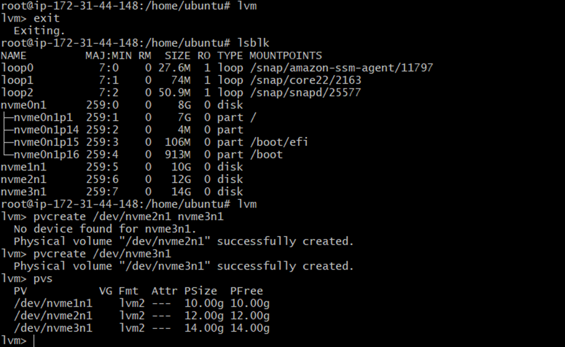
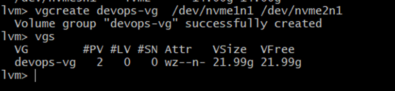
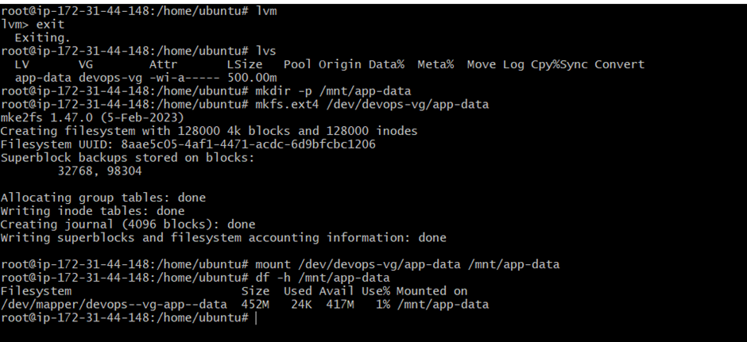
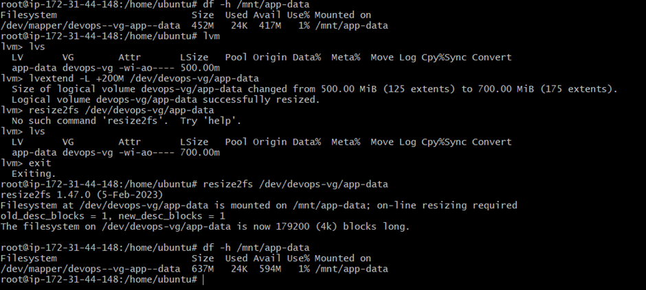

# Day 13 – Linux Volume Management (LVM)

## Task 1: Check Current Storage
Run: `lsblk`, `pvs`, `vgs`, `lvs`, `df -h`




## Task 2: Create Physical Volume
```bash
pvcreate /dev/nvme1n1 /dev/nvme2n1 /dev/nvme3n1
pvs
```

## Task 3: Create Volume Group
```bash
vgcreate devops-vg /dev/nvme1n1 /dev/nvme2n1
vgs
```


## Task 4: Create Logical Volume
```bash
lvcreate -L 500M -n app-data devops-vg
lvs
```


## Task 5: Format and Mount
```bash
mkdir -p /mnt/app-data
mkfs.ext4 /dev/devops-vg/app-data
mount /dev/devops-vg/app-data /mnt/app-data
df -h /mnt/app-data
```


## Task 6: Extend the Volume
```bash
lvextend -L +200M /dev/devops-vg/app-data
resize2fs /dev/devops-vg/app-data
df -h /mnt/app-data
```


## What you learned
- how to create volume , physical volume, volume group , logical volume and extend volume .
- how to check volume created or not.
- how to create volume on aws and attach it