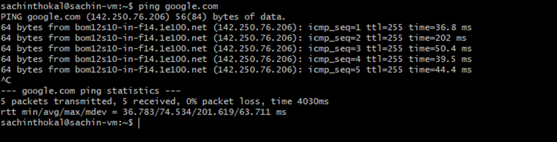
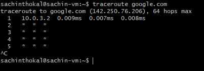
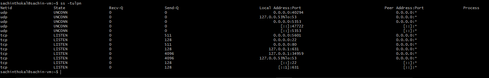
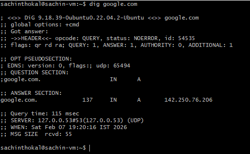
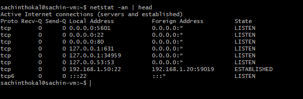

# Day 14 – Networking Basics & Troubleshooting

## Quick Concepts

### OSI vs TCP/IP

**OSI (7 layers)**
- L1 Physical – cables, signals  
- L2 Data Link – MAC, switches  
- L3 Network – IP, routing  
- L4 Transport – TCP/UDP ports  
- L5 Session – session control  
- L6 Presentation – encryption/format  
- L7 Application – user protocols (HTTP, DNS)

**TCP/IP (4 layers)**
- Link – physical + data link  
- Internet – IP routing  
- Transport – TCP/UDP  
- Application – HTTP, DNS, SSH, etc.

---

### Where protocols sit

- **IP** → Internet/Network layer  
- **TCP/UDP** → Transport layer  
- **HTTP/HTTPS** → Application layer  
- **DNS** → Application layer (uses UDP/TCP)

---

### Real Example

`curl https://example.com`  
= Application (HTTP) → Transport (TCP 443) → Internet (IP) → Link

---
# Hands-On Checks

**Target used:** google.com

- **Identity:** `hostname -I` (or `ip addr show`) 

- **Reachability:** `ping <target>` 
    - Observation:
        - Latency ~20–40 ms
        - 0% packet loss = good connectivity

- **Path:** `traceroute <target>` (or `tracepath`) 
    - Observation:
        - Shows hops between routers
        - Long delay at a hop may indicate network slowdown

- **Ports:** `ss -tulpn` (or `netstat -tulpn`) 
    - Observation:
        - Example: sshd listening on port 22
        - Confirms active services and ports

- **Name resolution:** `dig <domain>` or `nslookup <domain>` 
    - Observation:
        - Returns resolved IP addresses
        - Confirms DNS working

- **HTTP check:** `curl -I <http/https-url>` 
    - Observation:
        - HTTP/1.1 200 OK or 301/302 redirect
        - Confirms web service reachable

- **Connections snapshot:** `netstat -an | head` 
    - Observation:
        - LISTEN = waiting services  
        - ESTABLISHED = active connections

---

## Mini Task: Port Probe & Interpret
1) Identify one listening port from `ss -tulpn` (e.g., SSH on 22 or a local web app). 
- Example:
    - SSH running on port 22 
2) From the same machine, test it: `nc -zv localhost <port>` (or `curl -I http://localhost:<port>`). 
- nc -zv localhost 22 
-Result:
    - "succeeded" = reachable

3) Write one line: is it reachable? If not, what’s the next check? (e.g., service status, firewall).
- If reachable:
    - Service running normally

- If not reachable:
    - Check:
    - `systemctl status <service>`
    - firewall rules (`ufw status` or `iptables -L`)

---

# Reflection

## Which command gives the fastest signal when something is broken?

- `ping` — quickest way to check basic reachability and packet loss  
- If ping fails, I immediately know there may be network/connectivity issues

---

## What layer to inspect next?

**If DNS fails:**
- Application layer (DNS)
- Check resolver config (`/etc/resolv.conf`), try `dig` or `nslookup`

**If HTTP 500 shows up:**
- Application layer
- Likely server-side issue → check app logs and service status

---

## Two follow-up checks in a real incident

1. Check service status: `systemctl status <service>`
2. Check listening ports: `ss -tulpn`