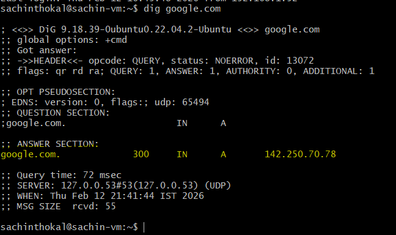
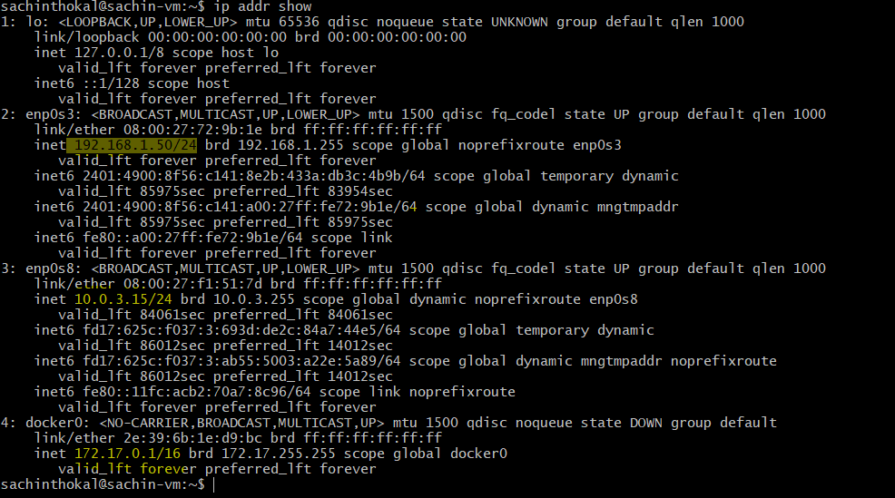
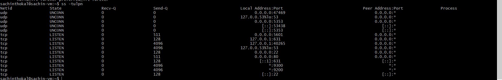

# Day 15 – Networking Concepts: DNS, IP, Subnets & Ports

### Task 1: DNS – How Names Become IPs
1. Explain in 3–4 lines: what happens when you type `google.com` in a browser?
    - The browser asks a DNS server for the IP address of google.com.
    - The DNS server returns the IP address.
    - The browser uses that IP to contact Google’s server.
    - The server responds and the webpage loads.

2. What are these record types? Write one line each:
    - `A` : Maps a domain to an IPv4 address
    - `AAAA` : Maps a domain to an IPv6 address
    - `CNAME` : Alias from one domain to another
    -  `MX` : Mail server record
    - `NS` : Specifies the name servers for a domain

3. Run: `dig google.com` — identify the A record and TTL from the output
    

---

### Task 2: IP Addressing
1. What is an IPv4 address? How is it structured? (e.g., `192.168.1.10`)
    - An IPv4 address is a 32-bit number divided into 4 parts separated by dots.
    - Example: 192.168.1.10

2. Difference between **public** and **private** IPs — give one example of each
    - Public IP: Accessible on the internet (Example: 8.8.8.8)
    - Private IP: Used inside local networks (Example: 192.168.1.5)

3. What are the private IP ranges?( `10.x.x.x`, `172.16.x.x – 172.31.x.x`, `192.168.x.x`)
    - 10.0.0.0 – 10.255.255.255 : Corporate networks , Large org networks
    - 172.16.0.0 – 172.31.255.255 : Medium size networks
    - 192.168.0.0 – 192.168.255.255 : router,laptop,Home/Small office

4. Run: `ip addr show` — identify which of your IPs are private
    

---

### Task 3: CIDR & Subnetting
1. What does `/24` mean in `192.168.1.0/24`?
    - 24 bits are for the network, 8 bits for hosts.

2. How many usable hosts in a `/24`? A `/16`? A `/28`?
    - /24: 254
    - /16: 65,534
    - /28: 14

3. Explain in your own words: why do we subnet?
    - Divide large networks
    - Improve security
    - Reduce traffic
    - Better IP management

4. Quick exercise — fill in:

    | CIDR | Subnet Mask     | Total IPs | Usable Hosts |
    | ---- | --------------- | --------- | ------------ |
    | /24  | 255.255.255.0   | 256       | 254          |
    | /16  | 255.255.0.0     | 65,536    | 65,534       |
    | /28  | 255.255.255.240 | 16        | 14           |

---

### Task 4: Ports – The Doors to Services
1. What is a port? Why do we need them?
    - A port is a number that identifies a specific service on a device.
    - It allows multiple services on one IP.

2. Document these common ports:

    | Port  | Service |
    | ----- | ------- |
    | 22    | SSH     |
    | 80    | HTTP    |
    | 443   | HTTPS   |
    | 53    | DNS     |
    | 3306  | MySQL   |
    | 6379  | Redis   |
    | 27017 | MongoDB |

3. Run `ss -tulpn` — match at least 2 listening ports to their services
    

---

### Task 5: Putting It Together
Answer in 2–3 lines each:
- You run `curl http://myapp.com:8080` — what networking concepts from today are involved?
    - DNS lookup
    - IP routing
    - Port 8080 connection
    - HTTP request/response
- Your app can't reach a database at `10.0.1.50:3306` — what would you check first?
    - IP reachable (ping)
    - Port open/firewall rules
    - DB service running
    - Network/security rules