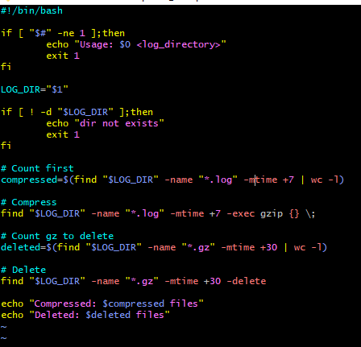
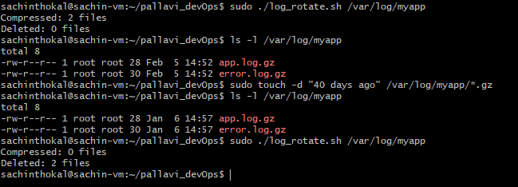
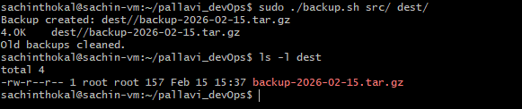
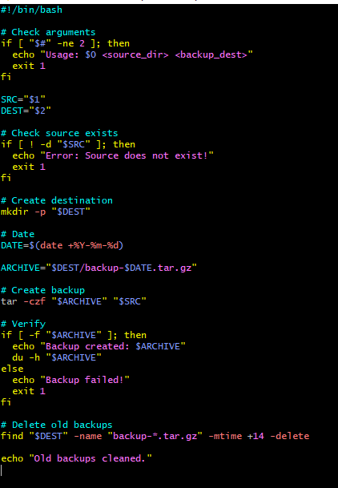
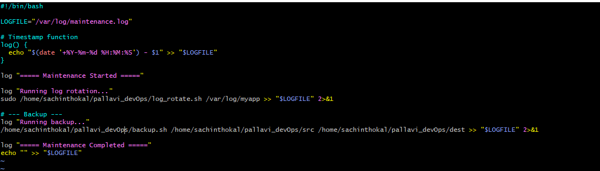
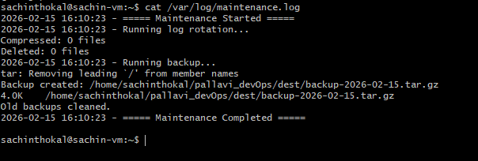

# Day 19 – Shell Scripting Project: Log Rotation, Backup & Crontab

## Challenge Tasks

### Task 1: Log Rotation Script
Create `log_rotate.sh` that:
1. Takes a log directory as an argument (e.g., `/var/log/myapp`)
2. Compresses `.log` files older than 7 days using `gzip`
3. Deletes `.gz` files older than 30 days
4. Prints how many files were compressed and deleted
5. Exits with an error if the directory doesn't exist

   

   

---

### Task 2: Server Backup Script
Create `backup.sh` that:
1. Takes a source directory and backup destination as arguments
2. Creates a timestamped `.tar.gz` archive (e.g., `backup-2026-02-08.tar.gz`)
3. Verifies the archive was created successfully
4. Prints archive name and size
5. Deletes backups older than 14 days from the destination
6. Handles errors — exit if source doesn't exist

   

   

---

### Task 3: Crontab
1. Read: `crontab -l` — what's currently scheduled?
2. Understand cron syntax:
   ```
   * * * * *  command
   │ │ │ │ │
   │ │ │ │ └── Day of week (0-7)
   │ │ │ └──── Month (1-12)
   │ │ └────── Day of month (1-31)
   │ └──────── Hour (0-23)
   └────────── Minute (0-59)
   ```
3. Write cron entries (in your markdown, don't apply if unsure) for:
   - Run `log_rotate.sh` every day at 2 AM
   - Run `backup.sh` every Sunday at 3 AM
   - Run a health check script every 5 minutes
   ```bash
   0 2 * * * /home/sachinthokal/pallavi_devOps/log_rotate.sh /var/log/myapp
   0 3 * * 0 /home/sachinthokal/pallavi_devOps/backup.sh /home/sachinthokal/pallavi_devOps/src /home/sachinthokal/pallavi_devOps/dest
   ```
---

### Task 4: Combine — Scheduled Maintenance Script
Create `maintenance.sh` that:
1. Calls your log rotation function
2. Calls your backup function
3. Logs all output to `/var/log/maintenance.log` with timestamps
4. Write the cron entry to run it daily at 1 AM

   
   
   

   