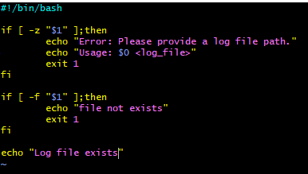
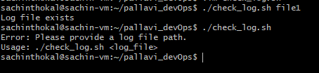
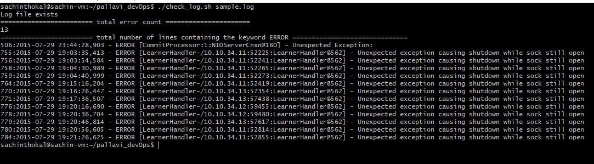
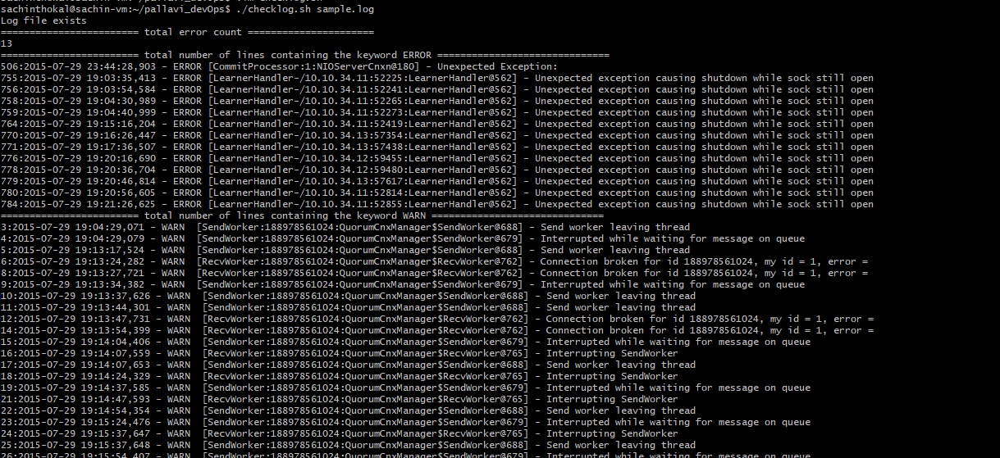
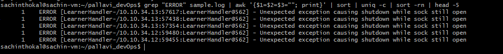
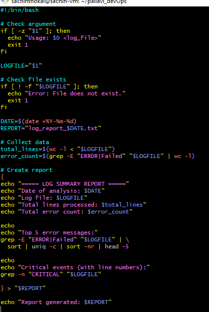
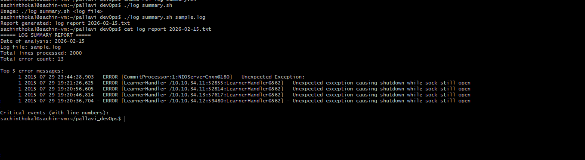
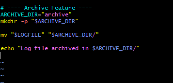

# Day 20 – Bash Scripting Challenge: Log Analyzer and Report Generator

## Challenge Tasks

### Task 1: Input and Validation
Your script should:
1. Accept the path to a log file as a command-line argument
2. Exit with a clear error message if no argument is provided
3. Exit with a clear error message if the file doesn't exist

    

    

---

### Task 2: Error Count
1. Count the total number of lines containing the keyword `ERROR` or `Failed`
2. Print the total error count to the console
    
---

### Task 3: Critical Events
1. Search for lines containing the keyword `WARN`
2. Print those lines along with their line number

    

---

### Task 4: Top Error Messages
1. Extract all lines containing `ERROR`
2. Identify the **top 5 most common** error messages
3. Display them with their occurrence count, sorted in descending order

    

---

### Task 5: Summary Report
Generate a summary report to a text file named `log_report_<date>.txt` (e.g., `log_report_2026-02-11.txt`). The report should include:
1. Date of analysis
2. Log file name
3. Total lines processed
4. Total error count
5. Top 5 error messages with their occurrence count
6. List of critical events with line numbers

    

    

---

### Task 6 (Optional): Archive Processed Logs
Add a feature to:
1. Create an `archive/` directory if it doesn't exist
2. Move the processed log file into `archive/` after analysis
3. Print a confirmation message

    
    
