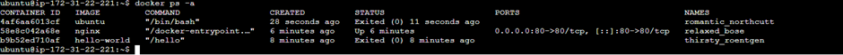
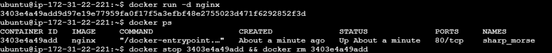
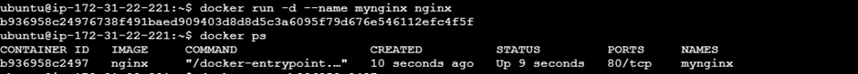
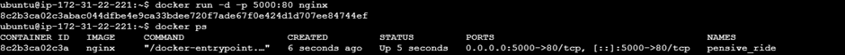
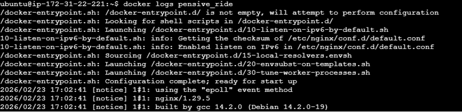
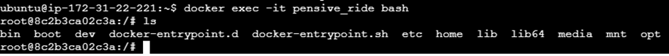

# Day 29 – Introduction to Docker

# 🐳 Docker – Challenge Task 1

## 📌 What is Docker?

Docker is a platform that allows developers to build, package, and run applications inside containers.

It ensures that applications run the same way:
- On a developer’s laptop
- On a testing server
- On production

Docker solves the problem: **“It works on my machine.”**

---

## 📦 What is a Container?

A container is a lightweight, standalone package that includes:

- Application code
- Runtime (Python, Node, Java, etc.)
- System libraries
- Dependencies
- Configuration files

Everything required to run the application is bundled together.

### ✅ Why Do We Need Containers?

Without containers:
- Dependency conflicts occur
- Different environments create issues
- Setup takes more time

With containers:
- Same environment everywhere
- Fast startup
- Lightweight
- Easy deployment
- Easy scaling

---

## 🖥️ Containers vs Virtual Machines

| Feature | Containers | Virtual Machines |
|----------|------------|-----------------|
| OS | Share host OS | Each VM has its own OS |
| Size | Lightweight (MBs) | Heavy (GBs) |
| Boot Time | Seconds | Minutes |
| Performance | Faster | Slower |
| Resource Usage | Low | High |

### 🔎 Real Difference

- Virtual Machines run a full guest OS using a hypervisor.
- Containers share the host OS kernel, making them lightweight and faster.

---

## 🧩 Architecture Comparison

### Virtual Machine Structure
```code
Hardware
↓
Host OS
↓
Hypervisor
↓
Guest OS
↓
Application
```

### Container Structure
```code
Hardware
↓
Host OS
↓
Docker Engine
↓
Container (App + Dependencies)
```

---

## 🏗️ Docker Architecture

Docker follows a Client-Server Architecture.

Main components:

1. Docker Client
2. Docker Daemon
3. Docker Images
4. Docker Containers
5. Docker Registry

---

### 1️⃣ Docker Client

Users run commands like:

docker build
docker run
docker pull


The client sends requests to the Docker Daemon.

---

### 2️⃣ Docker Daemon

- Runs in the background
- Builds images
- Runs containers
- Manages networks and volumes

---

### 3️⃣ Docker Images

- Blueprint for containers
- Read-only template
- Created using a Dockerfile

Example:

```dockerfile
FROM python:3.10
COPY . /app
RUN pip install -r requirements.txt
CMD ["python", "app.py"]
```

### 4️⃣ Docker Containers

Running instance of a Docker image

Can be started, stopped, restarted, or deleted

Example:
```bash
docker run my-app
```

### 5️⃣ Docker Registry

Stores Docker images

Can be public or private

Example: Docker Hub

Commands:

```bash
docker pull nginx
docker push my-image
```

### 🔄 Docker Architecture Flow

1. Docker Client sends a command.
2. Docker Daemon receives it.
3. If needed, it pulls the image from a registry.
4. The daemon creates a container using that image.
5. The container runs the application.

## 📊 Architecture Diagram
```code
        +-------------------+
        |   Docker Client   |
        +-------------------+
                  |
                  ↓
        +-------------------+
        |   Docker Daemon   |
        +-------------------+
           |            |
           ↓            ↓
     Docker Images   Docker Containers
           |
           ↓
       Docker Registry
```
---
# ✅ Task 2: Install Docker

1. Install Docker on your machine (or use a cloud instance)

```bash
sudo apt update
sudo apt install docker.io -y
```
2. Verify the installation

```bash
docker --version
```

3. Run the `hello-world` container

```bash
docker run hello-world
```

4. Read the output carefully — it explains what just happened
    - Docker pulls image from Docker Hub
    - Container runs
    - Message is printed
    - Container exits automatically

---

# ✅ Task 3: Run Real Containers
1. Run an **Nginx** container and access it in your browser
```bash
docker run -d -p 8080:80 nginx
```
2. Run an **Ubuntu** container in interactive mode — explore it like a mini Linux machine
```bash
docker run -it ubuntu
```
3. List all running containers
```bash
docker ps
```
4. List all containers (including stopped ones)
```bash
docker ps -a
```
5. Stop and remove a container
```bash
docker stop <container_id> && docker rm <container_id>
```



---

# ✅ Task 4: Explore
1. Run a container in **detached mode** — what's different?
```bash
docker run -d nginx
```
### Difference:
    - Runs in background
    - Terminal is free
    - No logs shown immediately



2. Give a container a custom **name**
```bash
docker run -d --name mynginx nginx
```



3. Map a **port** from the container to your host
```bash
docker run -d -p 5000:80 nginx
```



4. Check **logs** of a running container
```bash
docker logs mynginx
```



5. Run a command **inside** a running container
```bash
docker exec -it mynginx bash
```


