# Day 30 – Docker Images & Container Lifecycle

## Task 1: Docker Images
## 1. Pull the `nginx`, `ubuntu`, and `alpine` images from Docker Hub
```bash
docker pull nginx
docker pull ubuntu
docker pull alpine
```
---
## 2. List all images on your machine — note the sizes
```bash
docker images
```
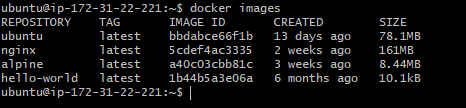
---
## 3. Compare `ubuntu` vs `alpine` — why is one much smaller?

| Feature | **Ubuntu** 🧳 | **Alpine** ✉️ |
| :--- | :--- | :--- |
| **Download Size** | ~75 MB | **~5 MB** |
| **Philosophy** | "Everything included" | "Bare essentials only" |
| **The "Brain"** | `glibc` (Big & Compatible) | `musl` (Tiny & Fast) |
| **The Tools** | Full GNU Suite | [BusyBox](https://www.busybox.net) (Multitool) |
| **Complexity** | Easy / Beginner-friendly | Minimalist / Pro-focused |

### 1. One Multitool instead of a Tool Shed
Ubuntu has a separate file for every command (like `ls`, `copy`, or `move`). **Alpine** uses [BusyBox](https://www.busybox.net), which is a single, tiny file that pretends to be all those tools at once. It’s like a Swiss Army knife replacing a 20lb toolbox.

### 2. A Slimmer "Brain" (The C Library)
Every Linux OS needs a C Library to talk to the hardware. 
*   **Ubuntu** uses `glibc`. It’s powerful and runs almost everything, but it’s heavy. 
*   **Alpine** uses [musl libc](https://musl.libc.org). It’s built from scratch to be as tiny as possible.

### 3. No "Just in Case" Files
Ubuntu includes extra stuff "just in case" you need it (like help manuals, extra languages, and common utilities). **Alpine includes nothing.** If you want a tool, you have to manually add it using the [Alpine Package Keeper (apk)](https://wiki.alpinelinux.org).

---

## Which one should you use?

### Use **Alpine** if:
*   You want your Docker images to download and start **instantly**.
*   You care about **security** (fewer files = fewer places for hackers to hide).
*   You are running simple microservices (Node.js, Python, Go).

### Use **Ubuntu** if:
*   You are a **beginner** and want things to "just work."
*   Your app needs specific software that requires `glibc` (like some heavy AI or Data Science tools).
*   You need a very specific library that isn't available in the [Alpine Repositories](https://pkgs.alpinelinux.org).

---

> **Summary:** Alpine is a **minimalist OS**. It’s smaller because it swaps heavy, standard parts for tiny, specialized ones.
---

## 4. Inspect an image — what information can you see?
```bash
docker image inspect ubuntu
```
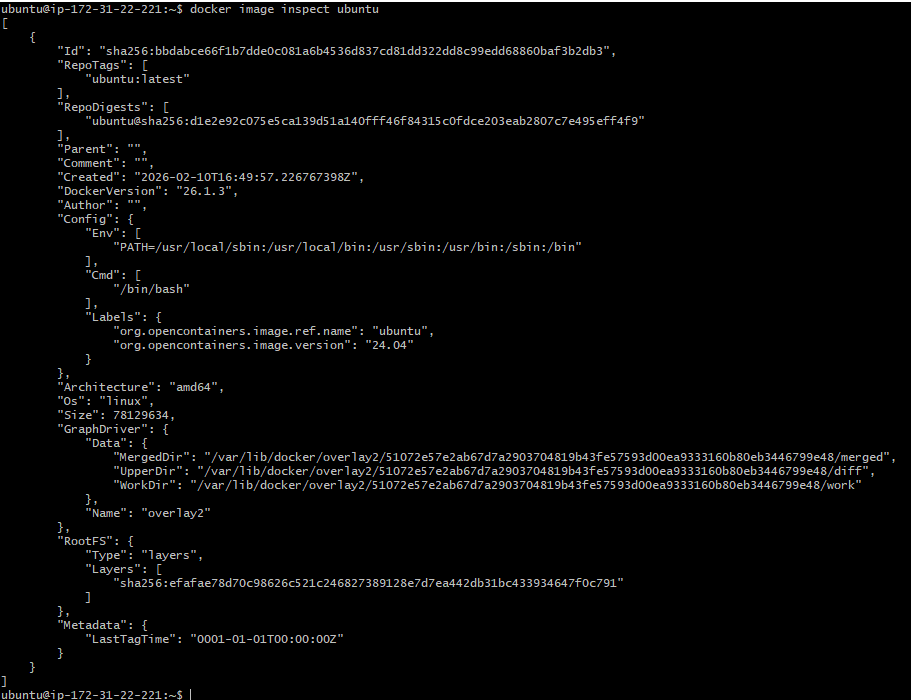

## 5. Remove an image you no longer need
```bash
docker ps -a
docker rm <container_id>
```

---

# Task 2: Image Layers
## 1. Run `docker image history nginx` — what do you see?

    - Each row = one layer
    - Some layers have sizes (e.g., 45MB, 5MB)
    - Some layers show 0B

## 2. Each line is a **layer**. Note how some layers show sizes and some show 0B
1. 0B layers usually come from:`CMD`,`ENV`,`EXPOSE`,`WORKDIR`,`Metadata instructions`
2. Because these instructions : Don’t copy files, Don’t install software, Don’t create large data, Only change configuration

## 3. Write in your notes: What are layers and why does Docker use them?
1. Each instruction in a Dockerfile creates a new layer:
```dockerfile
FROM ubuntu
RUN apt-get update
RUN apt-get install nginx
COPY . /app
CMD ["nginx"]
```
2. Efficiency (Reusability) :
If two images use the same base image (like ubuntu), Docker reuses that layer instead of downloading it again.

3. Faster Builds (Caching) : If you only change the last step in Dockerfile, Docker rebuilds only that layer.

---

### Task 3: Container Lifecycle
Practice the full lifecycle on one container:
1. **Create** a container (without starting it)
```bash
docker create --name mynginx nginx
docker ps -a
```
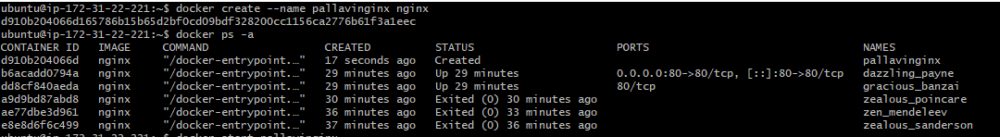
2. **Start** the container
```bash
docker start mynginx
docker ps -a
```
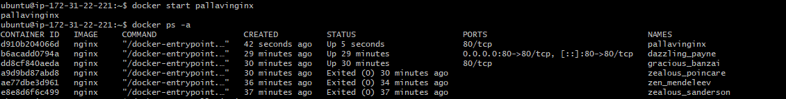
3. **Pause** it and check status
```bash
docker pause mynginx
docker ps -a
```
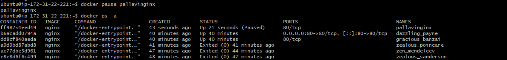
4. **Unpause** it
```bash
docker unpause mynginx
docker ps -a
```
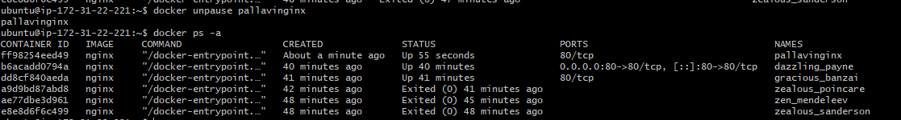
5. **Stop** it
```bash
docker stop mynginx
docker ps -a
```
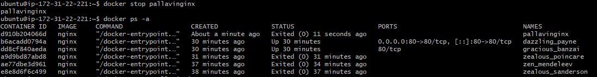
6. **Restart** it
```bash
docker restart mynginx
docker ps -a
```
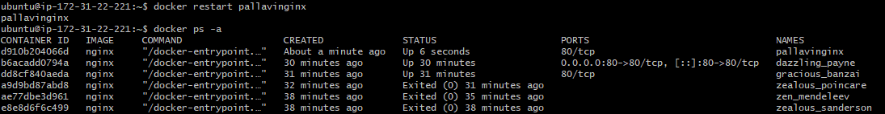
7. **Kill** it
```bash
docker kill mynginx
docker ps -a
```
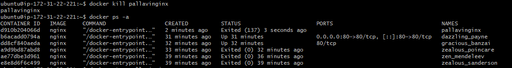
8. **Remove** it
```bash
docker stop mynginx
docker rm mynginx
docker ps -a
```
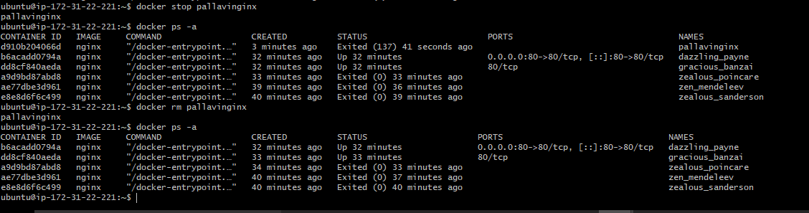

---

# Task 4: Working with Running Containers
1. Run an Nginx container in detached mode
```bash
docker run -d --name mynginx -p 8080:80 nginx
```
2. View its **logs**
```bash
docker logs mynginx
```
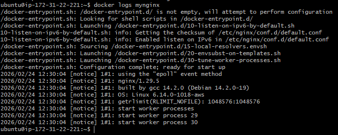

3. View **real-time logs** (follow mode)
```bash
docker logs -f mynginx

```

4. **Exec** into the container and look around the filesystem
```bash
docker exec -it mynginx /bin/sh
ls
cd /usr/share/nginx/html
ls
cat index.html
exit
```
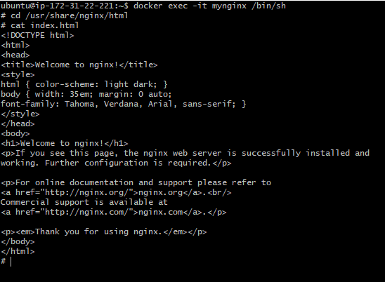

5. Run a single command inside the container without entering it
```bash
docker exec mynginx bash
```
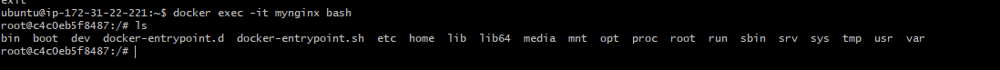

6. **Inspect** the container — find its IP address, port mappings, and mounts
```bash
docker inspect mynginx
```
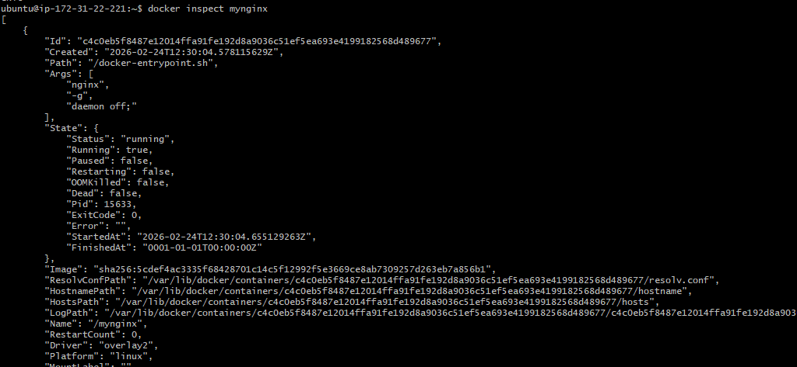

---

### Task 5: Cleanup
1. Stop all running containers in one command
```bash
docker stop $(docker ps -q)
```
- `docker ps -q` → Lists IDs of running containers
- `docker stop` → Stops them all
2. Remove all stopped containers in one command
```bash
docker container prune
docker container prune -f ==> To skip confirmation
```
3. Remove unused images
```bash
docker image prune => Remove dangling images only
docker image prune -a => Remove all unused images (not used by any container)
docker image prune -a -f => Without confirmation
```
4. Check how much disk space Docker is using
```bash
docker system df
```