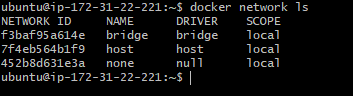
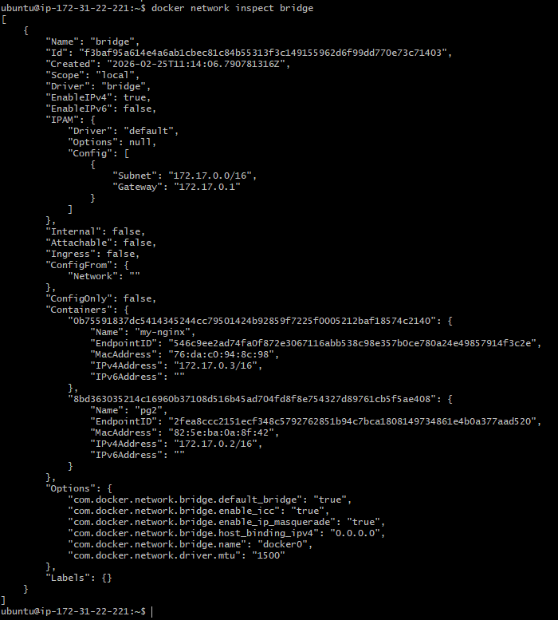

# Day 32 – Docker Volumes & Networking

## Challenge Tasks

### Task 1: The Problem
1. Run a Postgres or MySQL container
```bash
docker run --name my-postgres -e POSTGRES_PASSWORD=admin -d -p 5432:5432 postgres
```
2. Create some data inside it (a table, a few rows — anything)
```bash
docker exec -it my-postgres psql -U postgres
```
```sql
CREATE TABLE users (id INT, name VARCHAR(50));
INSERT INTO users VALUES (1, 'Pallavi');
SELECT * FROM users;
```
3. Stop and remove the container
```bash
docker stop my-postgres
docker rm my-postgres
```
4. Run a new one — is your data still there?
- Checked for the table again → Table was gone
- what happened
    - The data was deleted after removing the container.
- why
    - By default, Docker containers store data inside the container’s writable layer.
    - When the container is removed (docker rm), that writable layer is also deleted.
    - Since no volume was used, the database files were not saved anywhere outside the container.
    - So when we created a new container:
    - It started fresh.
    - No previous tables.
    - No previous data.

---

### Task 2: Named Volumes
1. Create a named volume
```bash
docker volume create pgdata
docker volume ls
```
2. Run the same database container, but this time **attach the volume** to it
```bash
docker run --name pg1 \
-e POSTGRES_PASSWORD=admin \
-v pgdata:/var/lib/postgresql \
-d postgres:18
```
3. Add some data, stop and remove the container
```bash
docker exec -it pg1 psql -U postgres
```
``sql
CREATE TABLE test (id INT);
INSERT INTO test VALUES (1);
SELECT * FROM test;
```
```bash
docker stop pg1
docker rm pg1
```
4. Run a brand new container with the **same volume**
```bash
docker run --name pg2 \
-e POSTGRES_PASSWORD=admin \
-v pgdata:/var/lib/postgresql \
-d postgres:18

docker exec -it pg2 psql -U postgres
```

```sql
SELECT * FROM test;
```
5. Is the data still there?
- YES — Data is still there
- Volume preserved database files
- Container removal did NOT delete volume
---

### Task 3: Bind Mounts
1. Create a folder on your host machine with an `index.html` file
```bash
mkdir my-website
cd my-website
echo "<h1>Hello from Bind Mount 🚀</h1>" > index.html
```
2. Run an Nginx container and **bind mount** your folder to the Nginx web directory
```bash
docker run --name my-nginx \
-p 8080:80 \
-v $(pwd):/usr/share/nginx/html \
-d nginx
```
3. Access the page in your browser

4. Edit the `index.html` on your host — refresh the browser
```bash
echo "<h1>Updated from Host 🔥</h1>" > index.html
```

Write in your notes: What is the difference between a named volume and a bind mount?

- Nginx container is directly using your host folder.
- Any change in host file is immediately reflected inside container.


| Named Volume                                          | Bind Mount                    |
| ----------------------------------------------------- | ----------------------------- |
| Managed by Docker                                     | Managed by you (host folder)  |
| Stored inside Docker area (`/var/lib/docker/volumes`) | Stored anywhere on host       |
| Docker controls location                              | You control exact path        |
| Safer & portable                                      | More flexible for development |
| Mostly used for databases                             | Mostly used for code & config |


---

### Task 4: Docker Networking Basics
1. List all Docker networks on your machine
```bash
docker network ls
```


2. Inspect the default `bridge` network
```bash
docker network inspect bridge
```



3. Run two containers on the default bridge — can they ping each other by **name**?
```bash
docker run -dit --name container1 ubuntu
docker run -dit --name container2 ubuntu
```
- Now from container1:
```bash
ping container2
```
- Result : They CANNOT ping by name on the default bridge network.
4. Run two containers on the default bridge — can they ping each other by **IP**?
```bash
- Find IP of container2:
docker inspect container2
- Now from container1: 
ping 172.17.0.X
```

| Method       | Works on Default Bridge? |
| ------------ | ------------------------ |
| Ping by Name | ❌ No                     |
| Ping by IP   | ✅ Yes                    |


---

### Task 5: Custom Networks
1. Create a custom bridge network called `my-app-net`
```bash
docker network create my-app-net
docker network ls
```
2. Run two containers on `my-app-net`
```bash
docker run -dit --name container1 --network my-app-net ubuntu
docker run -dit --name container2 --network my-app-net ubuntu
docker exec -it container1 bash
ping container2
```
3. Can they ping each other by **name** now?
- YES — They CAN ping by name.
4. Write in your notes: Why does custom networking allow name-based communication but the default bridge doesn't?

| Feature      | Default Bridge | Custom Bridge |
| ------------ | -------------- | ------------- |
| Ping by IP   | ✅ Yes          | ✅ Yes         |
| Ping by Name | ❌ No           | ✅ Yes         |
| DNS Support  | ❌ No           | ✅ Yes         |
| Recommended  | ❌ No           | ✅ Yes         |


---

### Task 6: Put It Together
1. Create a custom network
```bash
docker network create app-network
docker network ls
```
2. Run a **database container** (MySQL/Postgres) on that network with a volume for data
```bash
docker volume create pgdata

docker run -d \
  --name postgres-db \
  --network app-network \
  -e POSTGRES_USER=myuser \
  -e POSTGRES_PASSWORD=mypassword \
  -e POSTGRES_DB=mydb \
  -v pgdata:/var/lib/postgresql/data \
  postgres:15
```
3. Run an **app container** (use any image) on the same network
```bash
docker run -dit \
  --name app-container \
  --network app-network \
  ubuntu
```
4. Verify the app container can reach the database by container name
```bash
docker exec -it app-container bash
ping postgres-db
```

```code
app-container  --->  postgres-db
       |               |
       |               |
   app-network (custom bridge)
       |
     pgdata (volume)
```

- Custom network enables name-based communication
- Docker DNS resolves postgres-db automatically
- Volume ensures database data is not lost if container is removed