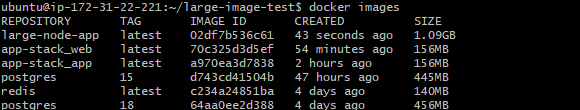
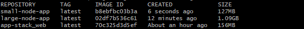

## Challenge Tasks

### Task 1: The Problem with Large Images
1. Write a simple Go, Java, or Node.js app (even a "Hello World" is fine)
2. Create a Dockerfile that builds and runs it in a **single stage**
3. Build the image and check its **size**

Note down the size — you'll compare it later.

```dockerfile
FROM node:18

WORKDIR /app

COPY package.json .
RUN npm install

COPY . .

CMD ["node", "app.js"]
```

```bash
docker build -t large-node-app .
docker images
```



---

### Task 2: Multi-Stage Build
1. Rewrite the Dockerfile using **multi-stage build**:
   - Stage 1: Build the app (install dependencies, compile)
   - Stage 2: Copy only the built artifact into a minimal base image (`alpine`, `distroless`, or `scratch`)
2. Build the image and check its size again
3. Compare the two sizes

Write in your notes: Why is the multi-stage image so much smaller?

```dockerfile
# Stage 1 – Build
FROM node:18-alpine AS builder

WORKDIR /app

COPY package.json .
RUN npm install --production

COPY . .

# Stage 2 – Minimal Runtime
FROM node:18-alpine

WORKDIR /app

COPY --from=builder /app /app

CMD ["node", "app.js"]
```

```bash
docker build -t small-node-app .
docker images
```



---

### Task 3: Push to Docker Hub
1. Create a free account on [Docker Hub](https://hub.docker.com) (if you don't have one)
2. Log in from your terminal
3. Tag your image properly: `yourusername/image-name:tag`

```bash
docker tag small-node-app yourusername/small-node-app:v1
```

4. Push it to Docker Hub

```bash
docker push yourusername/small-node-app:v1
```
5. Pull it on a different machine (or after removing locally) to verify
```bash
docker rmi yourusername/small-node-app:v1
docker pull yourusername/small-node-app:v1
```
---

### Task 4: Docker Hub Repository
1. Go to Docker Hub and check your pushed image
2. Add a **description** to the repository
3. Explore the **tags** tab — understand how versioning works
- Tags represent different versions of an image.
- Each tag points to a specific image version.
- Tags allow controlled and predictable deployments.

4. Pull a specific tag vs `latest` — what happens?
- Pulling v1 → downloads that exact version (stable & predictable)
- Pulling latest → downloads image currently tagged as latest
- latest is just a label, not automatically the newest version.

```
- Tags help in version control,
- Descriptions improve clarity,
- Pulling specific tags ensures consistent deployments.
```

---

### Task 5: Image Best Practices
Apply these to one of your images and rebuild:
1. Use a **minimal base image** (alpine vs ubuntu — compare sizes)
2. **Don't run as root** — add a non-root USER in your Dockerfile
3. Combine `RUN` commands to **reduce layers**
4. Use **specific tags** for base images (not `latest`)

Check the size before and after.

---