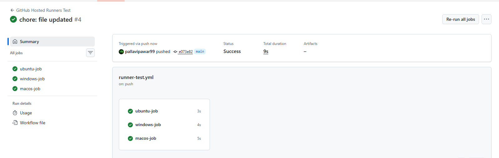
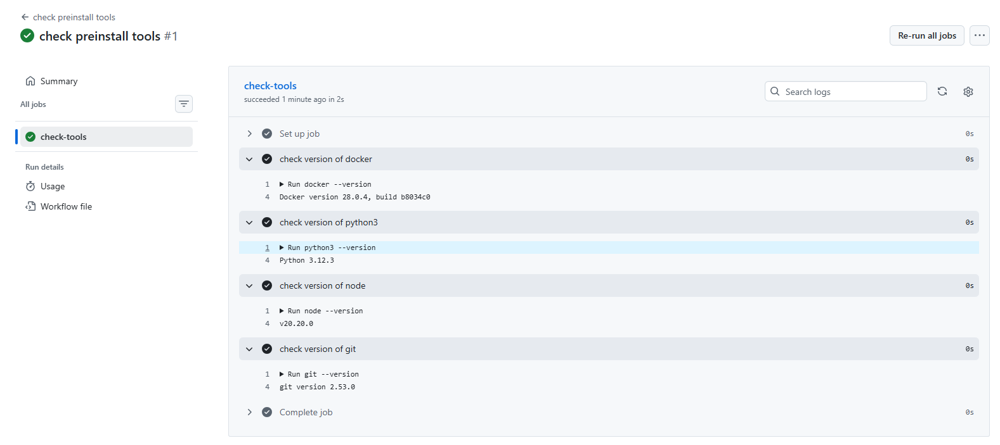
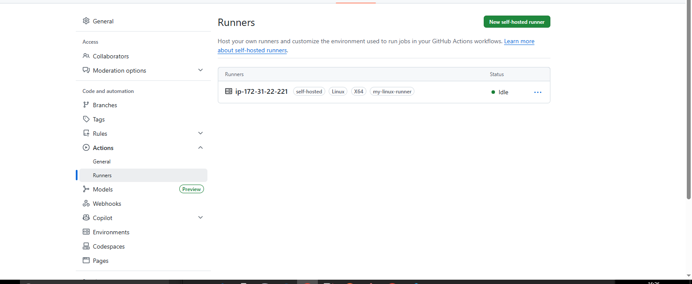
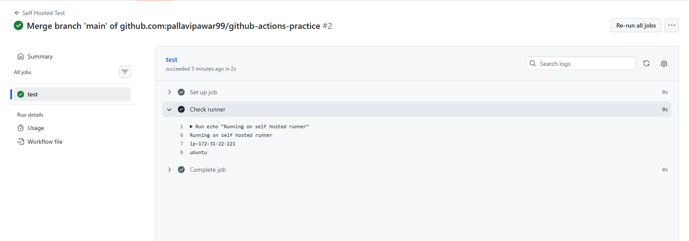

## Challenge Tasks

### Task 1: GitHub-Hosted Runners
1. Create a workflow with 3 jobs, each on a different OS:
   - `ubuntu-latest`
   - `windows-latest`
   - `macos-latest`
2. In each job, print:
   - The OS name
   - The runner's hostname
   - The current user running the job
3. Watch all 3 run in parallel

Write in your notes: What is a GitHub-hosted runner? Who manages it?

- What is a GitHub-hosted runner?
    - A GitHub-hosted runner is a temporary virtual machine (VM) provided by GitHub that runs your GitHub Actions workflows.
    - Each job runs inside a fresh VM with the operating system you specify like:
    - `ubuntu-latest` , `windows-latest` , `macos-latest`
    - After the job finishes, the VM is automatically deleted.

- Who manages it?
    - The GitHub platform manages the runner.
    - GitHub is responsible for:
        - Creating the VM
        - Installing common tools
        - Running the workflow
        - Cleaning up the environment after the job completes
    - Developers do not need to manage infrastructure.

---

### Task 2: Explore What's Pre-installed
1. On the `ubuntu-latest` runner, run a step that prints:
   - Docker version
   - Python version
   - Node version
   - Git version
2. Look up the GitHub docs for the full list of pre-installed software on `ubuntu-latest`

Write in your notes: Why does it matter that runners come with tools pre-installed?

- Faster workflow execution
    - Tools like Docker, Python, Node, and Git are already installed, so the workflow doesn't need to install them every time.
- Saves setup time
    - CI/CD pipelines start immediately without long installation steps.
- Consistency
    - Every workflow runs in a clean environment with the same tool versions, reducing environment-related bugs.
- Less configuration
    - Developers don't need to manually configure the environment.
- Better productivity
    - Teams can focus on building and testing code instead of environment setup.
---

### Task 3: Set Up a Self-Hosted Runner
1. Go to your GitHub repo → Settings → Actions → Runners → **New self-hosted runner**
2. Choose Linux as the OS
3. Follow the instructions to download and configure the runner on:
   - Your local machine, OR
   - A cloud VM (EC2, Utho, or any VPS)
4. Start the runner — verify it shows as **Idle** in GitHub

**Verify:** Your runner appears in the Runners list with a green dot.

---

### Task 4: Use Your Self-Hosted Runner
1. Create `.github/workflows/self-hosted.yml`
2. Set `runs-on: self-hosted`
3. Add steps that:
   - Print the hostname of the machine (it should be YOUR machine/VM)
   - Print the working directory
   - Create a file and verify it exists on your machine after the run
4. Trigger it and watch it run on your own hardware

**Verify:** Check your machine — is the file there?

- What is a self-hosted runner?
    - A self-hosted runner is a machine that you manage yourself (local PC, VM, or server) that runs GitHub Actions workflows.

| GitHub Hosted         | Self Hosted            |
| --------------------- | ---------------------- |
| Managed by GitHub     | Managed by you         |
| Temporary VM          | Your permanent machine |
| Limited customization | Full control           |
| Automatically cleaned | You maintain it        |

---

### Task 5: Labels
1. Add a **label** to your self-hosted runner (e.g., `my-linux-runner`)
2. Update your workflow to use `runs-on: [self-hosted, my-linux-runner]`
3. Trigger it — does it still pick up the job?

- Write in your notes: Why are labels useful when you have multiple self-hosted runners?
    - Labels help GitHub decide which runner should execute a job.
    - When you have many runners with different environments, labels allow you to target the correct machine.

---

### Task 6: GitHub-Hosted vs Self-Hosted
Fill this in your notes:

|                         | GitHub-Hosted                                                             | Self-Hosted                                                                 |
| ----------------------- | ------------------------------------------------------------------------- | --------------------------------------------------------------------------- |
| **Who manages it?**     | GitHub manages the infrastructure and runners                             | Managed by **you / your organization**                                      |
| **Cost**                | Free for public repos, limited free minutes for private repos (then paid) | You pay for the **server/VM (EC2, VPS, local machine)**                     |
| **Pre-installed tools** | Many tools already installed (Docker, Python, Node, Git, etc.)            | You install and manage all required tools                                   |
| **Good for**            | Quick setup, general CI/CD, small or medium projects                      | Custom environments, private networks, special hardware (GPU, large builds) |
| **Security concern**    | Runs on shared infrastructure but isolated VMs                            | Full control but you must secure and maintain the machine                   |

---