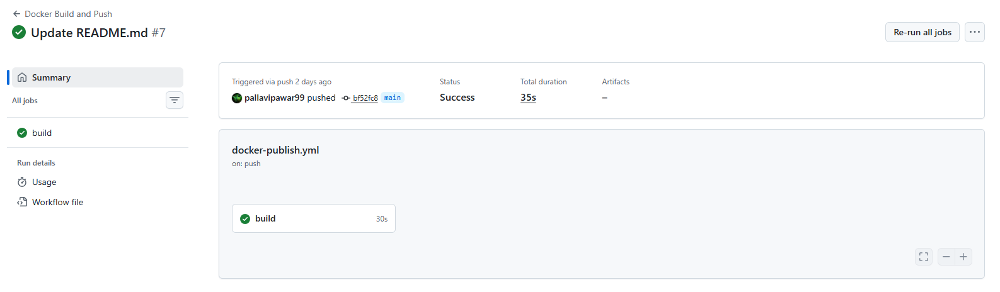
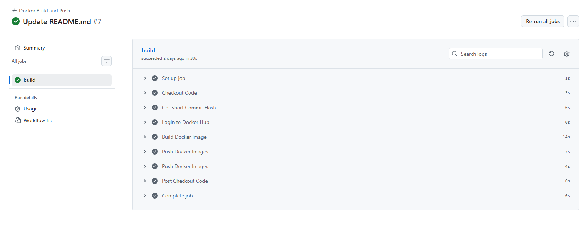

# Day 45 – Docker Build & Push in GitHub Actions

---

### Your Docker image live on Docker Hub

```
https://hub.docker.com/repository/docker/pawarpallavi/joke_app/general
```
---
### Screenshot of the pipeline run





---
### The full journey described in Task 6

- pushes code

```bash
git push origin main
```

- Workflow is triggered : GitHub Actions automatically triggers the pipeline when a push happens to the main branch.

```
.github/workflows/docker-publish.yml
```

- CI runner starts : GitHub starts a temporary Ubuntu runner.

```
Checkout repository code
↓
Build Docker image
↓
Login to Docker Hub
↓
Tag the image
↓
Push image to Docker Hub
```

- Docker image is built : 
    - This creates a container image using the Dockerfile.
    - This step uses Docker to package the application and its dependencies.

```bash
docker build -t username/github-actions-practice .
```

- Image is tagged : The image is tagged with two versions

```bash
username/repo:latest
username/repo:sha-<commit-hash>
```

- Image is pushed to registry : 

```bash
docker push username/github-actions-practice:latest
docker push username/github-actions-practice:sha-a31f2d
```

- Server pulls the image : A machine (local machine, VM, or cloud server) downloads the image:

```bash
docker pull username/github-actions-practice:latest
```

- Container starts : The container is started from the image

```bash
docker run -d -p 5000:5000 username/github-actions-practice:latest
```
- Application becomes accessible

#### Visual Flow Diagram

```
Developer
   │
   │ git push
   ▼
GitHub Repository
   │
   ▼
GitHub Actions (CI)
   │
   │ Build Docker Image
   │ Tag Image
   │ Push Image
   ▼
Docker Hub (Image Registry)
   │
   ▼
Server / Local Machine
   │
   │ docker pull
   │ docker run
   ▼
Running Container
   │
   ▼
Application Available to Users
```