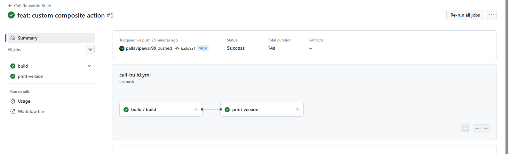
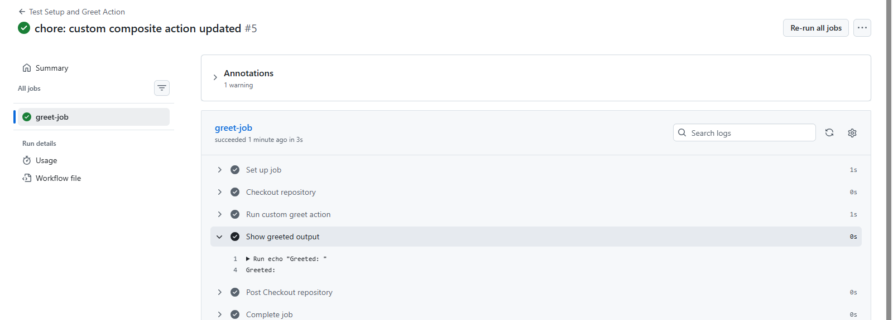

### Task 1: Understand `workflow_call`
Before writing any code, research and answer in your notes:
1. What is a **reusable workflow**?
    - A Reusable Workflow in GitHub Actions is a workflow that can be called by other workflows.
    - Instead of repeating the same CI/CD steps in multiple repositories or workflows, you create one workflow and reuse it.

2. What is the `workflow_call` trigger?

    - workflow_call is a special trigger that allows a workflow to be called by another workflow.
    - It tells GitHub that this workflow is not triggered by push/pull_request, but triggered by another workflow.

3. How is calling a reusable workflow different from using a regular action (`uses:`)?

| Feature      | Reusable Workflow                 | Regular Action       |
| ------------ | --------------------------------- | -------------------- |
| What it runs | **Full workflow (multiple jobs)** | **Single step**      |
| Trigger      | `workflow_call`                   | Used in `steps`      |
| Scope        | Entire CI pipeline logic          | Small reusable task  |
| Example      | Run tests + build + deploy        | Install dependencies |

4. Where must a reusable workflow file live?

    - Reusable workflows must be stored in: `.github/workflows/`

---

### Task 4: Add Outputs to the Reusable Workflow

---

### Task 5: Create a Composite Action

---

### Task 6: Reusable Workflow vs Composite Action

|                                  | Reusable Workflow                                                  | Composite Action                                                                  |
| -------------------------------- | ------------------------------------------------------------------ | --------------------------------------------------------------------------------- |
| **Triggered by**                 | `workflow_call`                                                    | `uses:` in a workflow step                                                        |
| **Can contain jobs?**            | ✅ Yes, multiple jobs allowed                                       | ❌ No, can only have steps                                                         |
| **Can contain multiple steps?**  | ✅ Yes, each job can have multiple steps                            | ✅ Yes, can contain multiple steps inside a single job                             |
| **Lives where?**                 | `.github/workflows/*.yml`                                          | `.github/actions/<action-folder>/action.yml`                                      |
| **Can accept secrets directly?** | ✅ Yes, define `secrets:` in `workflow_call`                        | ❌ No, must pass secrets via `with:` or environment variables from the caller step |
| **Best for**                     | Reusing full CI/CD pipelines (jobs + steps) across workflows/repos | Reusing common sequences of steps within a job (like setup, install, logging)     |

