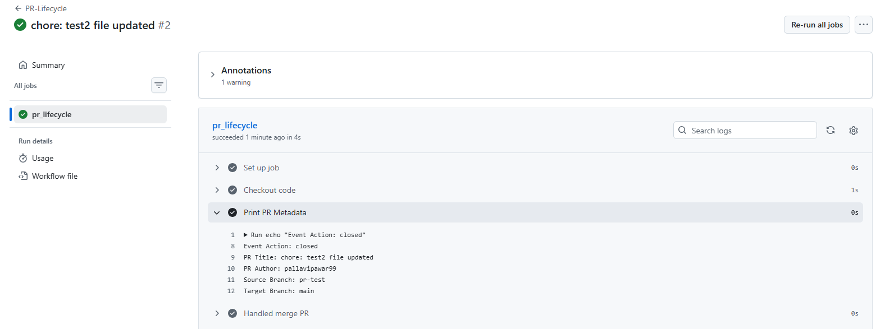
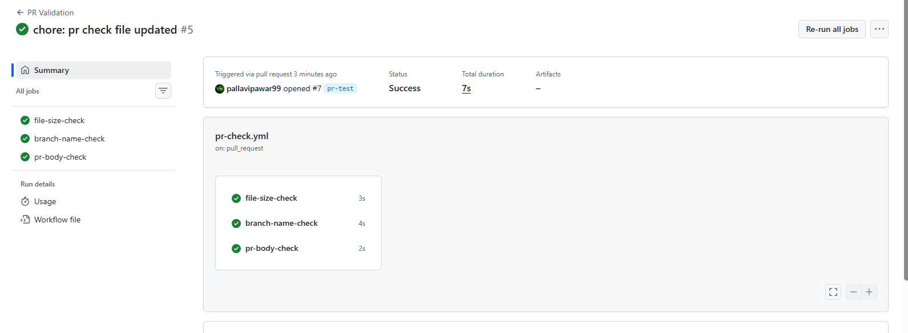
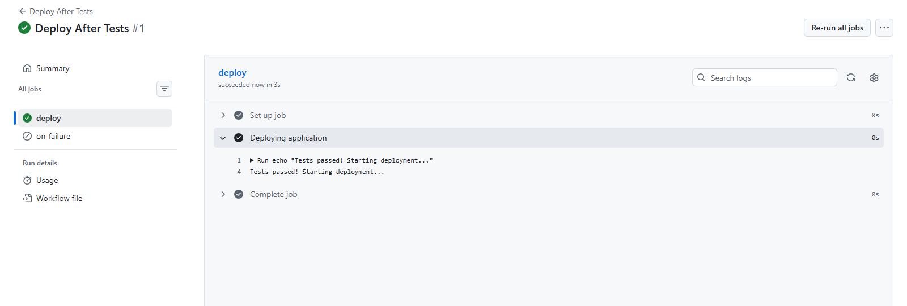

### Task 1: Pull Request Event Types

### Task 2: PR Validation Workflow

### Task 3: Scheduled Workflows (Cron Deep Dive)
Write in your notes:
- The cron expression for: every weekday at 9 AM IST
    - `30 3 * * 1-5` (9:00 AM IST is 3:30 AM UTC. 1-5 covers Monday through Friday.)
- The cron expression for: first day of every month at midnight
    - `0 0 1 * *` (Runs at 00:00 on the 1st of every month.) 
- Why GitHub says scheduled workflows may be delayed or skipped on inactive repos
    - Resource Load: During peak times (usually at the start of the hour), GitHub's infrastructure manages millions of workflows. Your job stays in a queue until a runner is available.
    - Repo Inactivity: If a public repository has had no activity for 60 days, GitHub automatically disables scheduled workflows to save resources. You have to manually re-enable them or push a commit to keep them active. 

### Task 4: Path & Branch Filters

- Test it: push a change to a `.md` file — does the workflow skip?
    - Yes. If you push a change to README.md or docs/guide.md, the workflow will not trigger. GitHub's logic is "Positive match (paths) AND NOT negative match (paths-ignore)". Since .md files aren't in src/ or app/, they don't meet the first criteria anyway

- Write in your notes: When would you use `paths` vs `paths-ignore`?
    - Use paths when:
        - You have a specific target (e.g., a Monorepo where the frontend workflow should only run if the frontend/ folder changes).
        - You want to ensure the workflow only runs when functional code changes (like .js, .py, or .go files).

    - Use paths-ignore when:
        - You want the workflow to run for almost everything, except for "noise" like documentation, CI config updates, or .gitignore changes.
        - It is easier to list the things that don't matter than the things that do.

### Task 5: `workflow_run` — Chain Workflows Together

### Task 6: `repository_dispatch` — External Event Triggers

